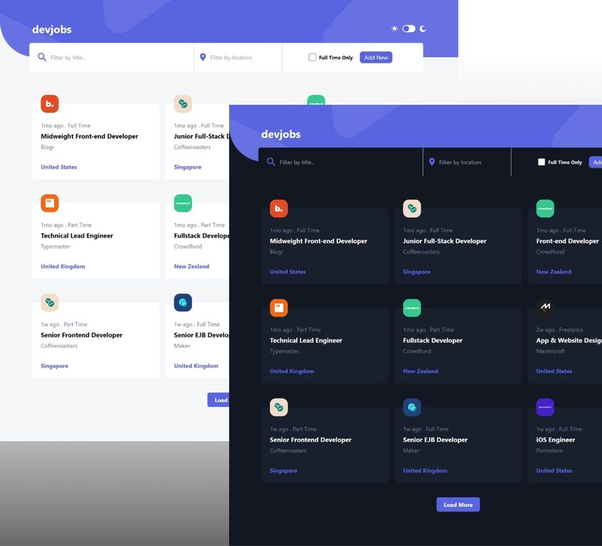
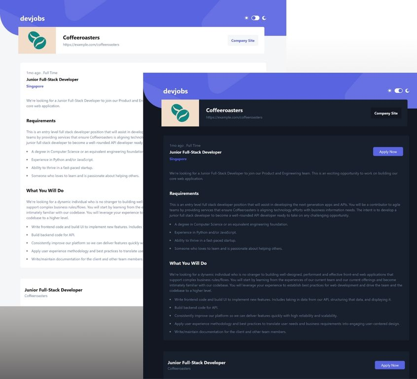
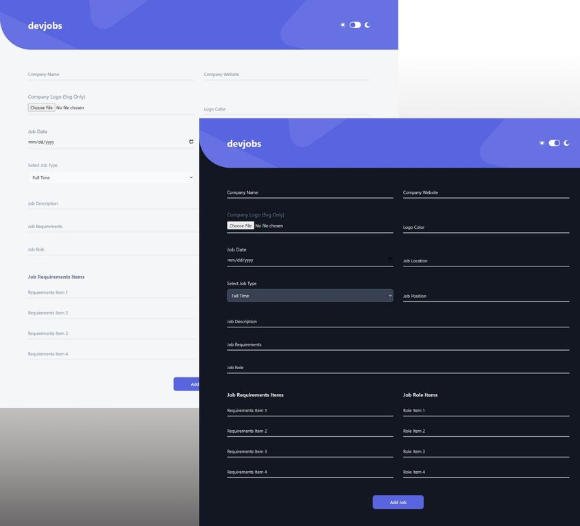

# EPFL - Final Project

A dev-jobs app with Flask and JavaScript.

## Table of content

- [Live URL](#live-url)
- [Description](#description)
- [Screenshots](#screenshots)
- [Tools](#tools)
- [Installation](#installation-requirements)
- [Run](#run-the-development-server)

### Live URL

https://dev-jobs-2vdl.onrender.com/

### Description

Users should be able to:

- View the optimal layout for each of the website's pages depending on their
  device's screen size.
- View each page and be able to toggle between the tabs to see different
  information.
- Be able to filter jobs from the home page.
- Be able to search for a specific job.
- Be able to click a job from the home page so that they can read more
  information and apply for the job.
- Add a new job.

### Screenshots

 


### Tools

- HTML
- CSS & Tailwind CSS
- JavaScrip & Browser Local Storage
- Python & Flask

### Installation Requirements

- Python - V 3.11.5
- Flask - V 3.0.0

### Run The Development Server

#### Using Flask Run:

1. Install Python (https://www.python.org/downloads/)
2. Install required dependencies:

```
 pip install -r requirements.txt
```

3. Then run the app with:

```python
flask run
```

4. Open a new webpage with this address (http://127.0.0.1:5000)

#### Using Docker:

1. Install Docker (https://www.docker.com/products/docker-desktop/)
2. Build and run:

```python
docker compose up --build # Only for the first run
docker compose up # For subsequent runs
```

4. Open a new webpage with this address (http://127.0.0.1:8000)
